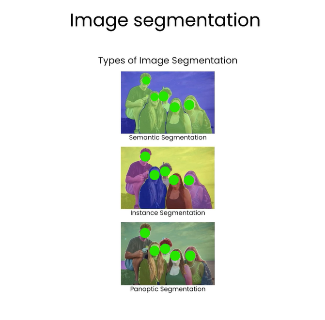
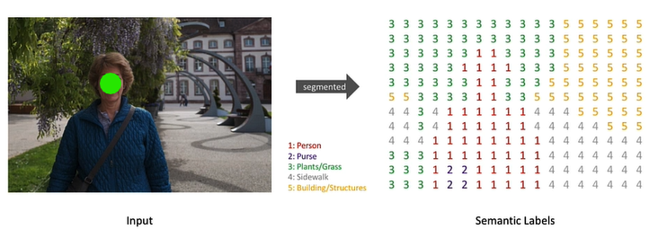
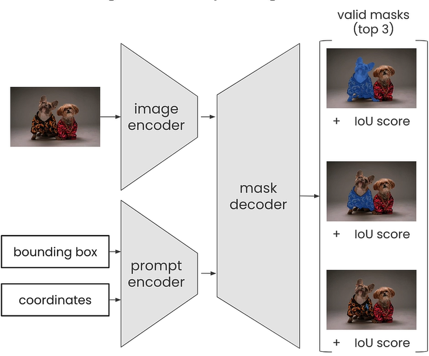
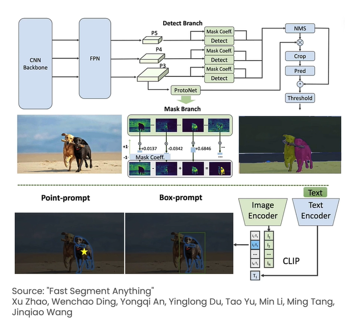
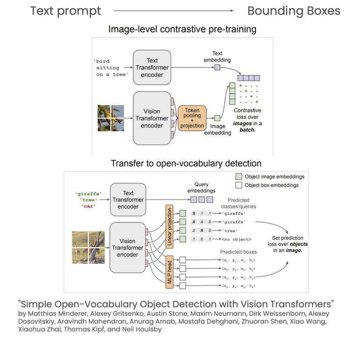
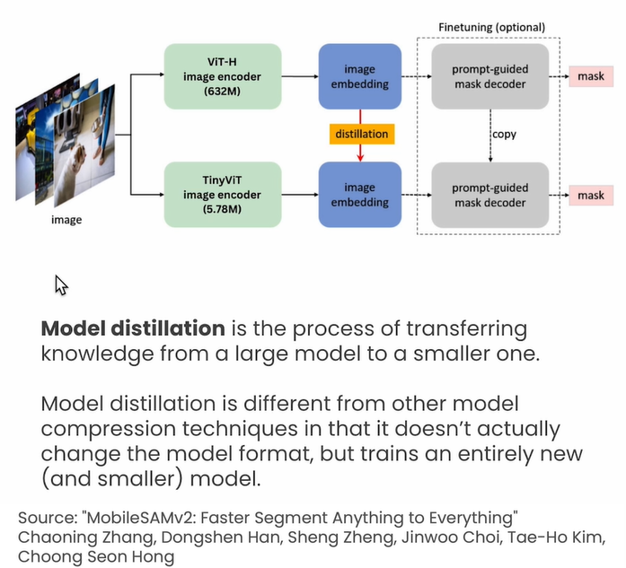

# L2 Image segmentation

## What is Image Segmentation
- what is image segmentation?
    - Image segmentation is a technique in computer vision that partitions a digital image into discrete group of pixels
    - example:

    
    - image segmentation is typically used to locate objects and boundaries in images
    - it is commonly used in object detection, 3D reconstruction and image editing workflows
    - it is the process of assigning a label to every pixel in an image, such that pixels with the same label share certain characteristics
    
    

- methods to visually prompt the Segment Anythin Model (SAM) of Meta AI:
    - prompting with a set of pixel coordinates
    - prompting with multiple sets of coordinates
    - prompting with bounding boxes
    - using a positive prompt along with a negative prompt

## Segmentation Anything Model

-  SAG is widely used for image segmentation, image captioning and iamge editing  
- however, the original SAM has high computational cost (mainly due to its transformer architecture), preventing it from wider adaption
- SAM accepts either bounding box coordinates or single pixel coordinates, as well as an input image

    
    - each of the inputs are encoded by an image encoder and an prompt encoder respectively
    - they are then fed into the masked decoder
    - and SAM outputs the top three valid masks for that point or bounding box

## FastSAM
- FastSAM is a CNN based SAM model trained using only 2% of the original data set published by the SAM authors
- it achives comparable performance on 32x32 images, but at 50 times higher the runtime speed

    
- prompting FastSAM also differs slightly from prompting the original SAM
- FastSAM also automatically detects all masks in an image above a configurable confidence threshold
- it then filters all the generated masks based on the prompts provided by the user

# L3 Object Detection

- use of text instead of prompts to generate masks
- a pipeline of models where the output of one model is fed as the input into the second model
    - use OWL-ViT to generate bounding boxes based on text prompt
    - then use SAM-based model to segment the image based on the generated bounding boxes

## OWL-ViT
- this ia zero-shot object detection model, meaning it can detect objects within an image based on simple text prompts

    

- being zero-shot means that you do not need to train it anyway for it to detect any object within an image
- we can use a string of text to generate a bounding box

## MobileSAM
- the MonbileSAM has been optimized to run on devices that might not have access to GPUs
- to perform more efficiently, MobileSAM uses a process known as `model distillation`

    
- model distillation allows you to take a very large model and transfer its knowlegde to a smaller model, allowing you to run the model more efficiently
- model distillation is a different technique compared to model compression techniques or quantization in the sense that it does not actually change the model format, but trains an entirely new and much smaller model

# References
- [Semantic Segmentation](https://www.jeremyjordan.me/semantic-segmentation/)